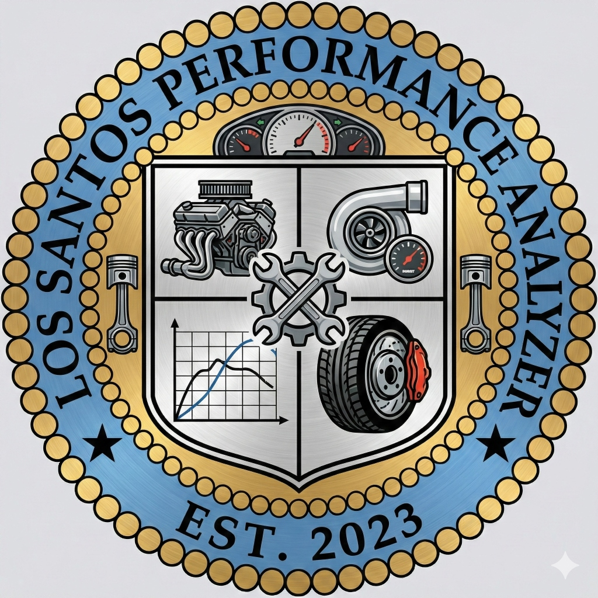

# Los Santos Performance Analyzer (LSPA)

# Los Santos Performance Analyzer (LSPA)



## 🏎️ Description (Descripción)

**Los Santos Performance Analyzer (LSPA)** is a cutting-edge web application designed for vehicle enthusiasts in the Los Santos area. It provides a comprehensive catalog of all available vehicles, detailed performance statistics (Speed, Acceleration, Handling, Braking), and tools to compare them.

The Home page features a **Futuristic "Cyber" Design** with neon accents, glassmorphism effects, and dynamic filtering. Users can filter vehicles by Manufacturer, Class, Speed, features (Weaponized, Imani Tech, HSW), and sort them by any metric.

The application also includes a **Versus Mode** for head-to-head comparisons and a **Location** page showing our HQ on a map.

## 🚀 Key Features

- **Smart Catalog**: Filter 400+ vehicles by Class, Manufacturer, and Stats.
- **Versus Mode**: Compare two vehicles side-by-side to see the winner in every category.
- **Dynamic Sorting**: Sort by Speed, Acceleration, Handling, or Braking (Low/High).
- **Responsive Design**: Fully optimized for Desktop, Tablet, and Mobile.
- **Interactive Map**: Location page using Leaflet.

## 🛠️ Third-Party Components (Componentes de terceros)

1.  **[React Router Dom](https://reactrouter.com/)**: Used for seamless client-side navigation between Home, Versus, and Location pages.
2.  **[Leaflet](https://leafletjs.com/) & [React-Leaflet](https://react-leaflet.js.org/)**: Used to render the interactive map on the Location page.
3.  **[Axios](https://axios-http.com/)**: Used in the data import scripts to fetch vehicle data from external repositories.
4.  **[Google Fonts](https://fonts.google.com/)**: Specifically 'Orbitron' and 'Inter' for the futuristic typography.

## 📚 Tutorials & Resources (Enlaces de ayuda)

-   [Best-README-Template](https://github.com/othneildrew/Best-README-Template): Used as inspiration for this README.
-   [CSS Glassmorphism Generator](https://css.glass/): Helped with the sidebar and card styles.
-   [Leaflet Quick Start Guide](https://leafletjs.com/examples/quick-start/): Guide for setting up the map.
-   [GTA V Data Dumps](https://github.com/DurtyFree/gta-v-data-dumps): Source of the raw vehicle data.

## 🎨 Design & Inspiration

The design is heavily inspired by **Cyberpunk UI** and **Futuristic HUDs**, incorporating dark themes, neon cyan/magenta accents (Cyberpunk 2077 style), and minimalist layouts.

-   **Figma Concept**: [Link to Figma Prototype (Placeholder)](https://figma.com)

## 📂 Project Structure

-   `src/components`: Reusable UI components (Header, Footer, VehicleCard).
-   `src/pages`: Main view components (Home, VersusMode, Location).
-   `src/data`: JSON data files.
-   `scripts`: Node.js scripts for data processing.

## 💻 Installation & Setup

1.  **Clone the repository**:
    ```bash
    git clone https://github.com/CRACKXXXX/LSPA.git
    ```
2.  **Install dependencies**:
    ```bash
    npm install
    ```
3.  **Run the development server**:
    ```bash
    npm run dev
    ```
4.  **Build for production**:
    ```bash
    npm run build
    ```

## ⚖️ License & Credits

© 2026 Los Santos Performance Analyzer. 
Built by **Crackorb**.
Images provided by **KevinLDG** & **GTA Assets**.

---
*This project was developed for the React Development Course.*
