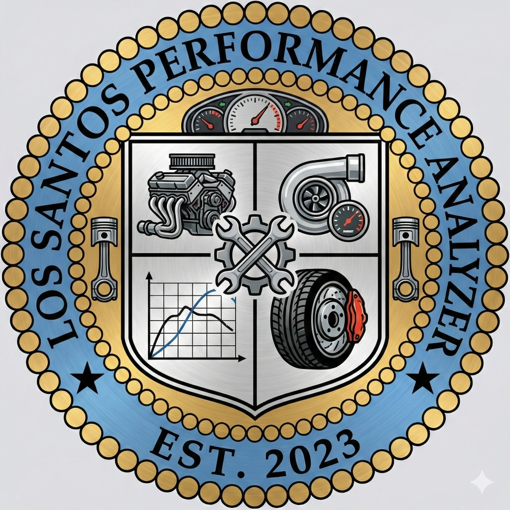
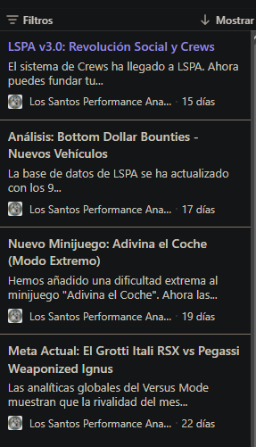

<a name="readme-top"></a>

<!-- PROJECT LOGO -->
<div align="center">
  <a href="https://github.com/CRACKXXXX/LSPA">
    
  </a>

  <h1 align="center">🏎️ Los Santos Performance Analyzer (LSPA)</h1>

  <p align="center">
    <strong>The Ultimate Vehicle Performance Database for GTA V Online</strong><br/>
    Real Stats · VS Comparator · Minigames · Leveling System · Admin Panel
    <br /><br />
    <a href="https://github.com/CRACKXXXX/LSPA"><strong>📖 Explore the Docs »</strong></a>
    <br />
    <a href="https://github.com/CRACKXXXX/LSPA">Demo</a>
    ·
    <a href="https://github.com/CRACKXXXX/LSPA/issues">Report Bug</a>
    ·
    <a href="https://github.com/CRACKXXXX/LSPA/issues">Request Feature</a>
  </p>

  
  
  
  
   
  [](https://www.figma.com/design/ij2v0mmPVX6hvLxbpGX3bB/LSPA---Los-Santos-Performance-Analyzer?m=auto&t=DfY4vpOxPvqq2A9Y-6)
</div>

---

## 📋 Table of Contents

- [About The Project](#-about-the-project)
- [Figma Design](#-figma-design)
- [Key Features](#-key-features)
- [Technical Architecture](#-technical-architecture)
- [Installation](#-installation)
- [Available Scripts](#-available-scripts)
- [Project Structure](#-project-structure)
- [User System](#-user-system)
- [Gamification System](#-gamification-system)
- [Vehicle Database](#-vehicle-database)
- [Pages and Routes](#-pages-and-routes)
- [Technologies Used](#-technologies-used)
- [Credits and Resources](#-credits-and-resources)
- [Contact](#-contact)

---

## 🚗 About The Project

**LSPA (Los Santos Performance Analyzer)** is a comprehensive web application that allows GTA V/Online players to:

- 📊 Browse **real statistics** for over **713 vehicles** (extracted from game files)
- ⚔️ Compare vehicles head-to-head in **Versus Mode**
- 🎮 Play **3 minigames** to earn XP and level up
- 🏠 Manage a **Personal Garage** with collection and tags
- 📈 Visualize your collection **Analytics** with charts
- 🏆 Compete on the global **Leaderboard**
- 🛡️ Manage users from the **Admin Panel** (admins only)

The application features a **Cyberpunk/Neon** aesthetic with dark mode, glassmorphism, and smooth animations.

(<a href="#readme-top">back to top</a>)</p>

---

## 🎨 Figma Design

The full UI/UX design for LSPA was planned and prototyped in Figma before development.

<div align="center">

🔗 **[View the Figma Design File](https://www.figma.com/design/ij2v0mmPVX6hvLxbpGX3bB/LSPA---Los-Santos-Performance-Analyzer?m=auto&t=DfY4vpOxPvqq2A9Y-6)**

</div>

The Figma file includes:

| Section | Details |
|---------|--------|
| 🖼️ **Wireframes** | Low-fidelity layout sketches for all pages |
| 🧩 **Component Library** | Reusable UI components (cards, buttons, modals, navbar) |
| 🎨 **Color System** | Full dark-mode palette with Cyberpunk/Neon theme tokens |
| 📐 **Typography** | Font scales using Outfit and Russo One |
| 📱 **Responsive Layouts** | Desktop, tablet, and mobile breakpoints |
| 🎮 **Page Designs** | High-fidelity mockups for Home, Versus, Garage, Profile, and more |

<p align="right">(<a href="#readme-top">back to top</a>)</p>

---

## 🆕 Recent Updates (v3.0 - Social Revolution & UX Polish)

### 🏴‍☠️ Crew System 3.0 (Full Social)
- **Dedicated Admin Panel**: Separate management page for leaders with glassmorphism UI.
- **Role Hierarchy**: Full rank system (Owner > Co-Owner > Staff > Veteran > Noob).
- **Global Chat**: Encrypted private channels for crew members.

### 🏆 Competition Layer
- **Global Leaderboard**: Real-time Top 50 ranking based on Total XP.
- **Profile Integration**: Direct link to global standing from user profile.
- **Dynamic Badges**: Custom rank indicators in the navbar.

### 📡 System & Connectivity
- **RSS Feed Integration**: A dedicated landing page `/rss` with an XML feed (`feed.xml`) containing game news and patch notes.
- **Firebase Database & Hosting**: Live connection to Cloud Firestore for the Foro/News CRUD system. Deployed at: **[https://lspa-joel.web.app](https://lspa-joel.web.app)**
- **Foro / News (CRUD)**: Full Create, Read, Update, and Delete operations on news articles, managed via the Admin Panel and stored in Firestore.

#### 📖 RSS Feed Reader Demonstration
The following screenshot shows a real RSS feed reader consuming the LSPA feed at `https://lspa-joel.web.app/feed.xml`. Each item points to the deployed application:
<br/>


### 📘 User Experience
- **Player's Handbook**: Rewrote the entire Guide/FAQ to be user-centric (no technical jargon).
- **Smart Navigation**: Dynamic garage badge that only appears when relevant.
- **Visual Overhaul**: New "Magma" login theme and refined animations.

---

## 🆕 Recent Updates (v2.0 - Polish & Community)
<details>
<summary>View v2.0 Changelog</summary>

### 👥 Crew System 2.0
- **Deep Level Scanner**: New algorithm that accurately calculates Crew XP by scanning member stats depth-first.
- **Dedicated Admin Panel**: New `/crew-admin` route for Staff+ with advanced tooltips and animated UI.
- **Smart Privacy**: New crews now default to 'Public' for better discoverability.

### 📱 Mobile Experience Overhaul
- **Responsive Vehicle Cards**: 
    - **Adaptive Sizing**: Buttons scale progressively (40px Desktop ➔ 48px Tablet ➔ 56px Mobile).
    - **Visual Impact**: Vehicle images enlarged by 40% on mobile devices for better clarity.
    - **Touch Optimized**: Expanded hit areas for 'Favorite' and 'Reader Mode' actions.

### ⚖️ Compliance & Polish
- **Legal Footer**: Updated copyright notices and navigation links.
- **Clean Code Audit**: Refactored Context logic and removed redundancy.
</details>

---

## ✨ Key Features

### 🏠 Vehicle Catalog (Home)
- Responsive grid with **713+ verified vehicles**
- **Advanced filters**: by class (Super, Muscle, SUV...), manufacturer, price
- **Real-time search** by name
- **Sorting options**: speed, price, acceleration, handling
- Cards with **color-coded stats** (green=excellent, pink=god-tier)
- **Favorites button** to add to garage

### ⚔️ Versus Mode (Comparator)
- Select 2 vehicles for direct comparison
- Side-by-side visualization of all statistics
- **Winner highlighted** in green for each category
- Stats: Speed, Acceleration, Handling, Braking, Price

### 🎮 Minigames Suite
| Game | Description | Reward |
|------|-------------|--------|
| **🔍 Guess The Car** | Identify the blurred vehicle before time runs out | +50-100 XP |
| **⬆️⬇️ Higher or Lower** | Is the next car faster or slower? | +25 XP per correct |
| **⚔️ Battle Cards** | Choose a stat to beat the CPU | +100-150 XP per win |

### 🏠 Personal Garage
- Private collection linked to your account
- **Status tags**: Obtained ✅ | Hunting 🎯 | Priority ⭐
- Garage statistics: total value, average speed
- Syncs with your public profile

### 📈 Analytics Dashboard
- **Pie Chart**: Distribution by vehicle class
- **Bar Chart**: Average statistics
- **Total Value** of your collection
- Powered by **Chart.js**

### 🏆 Leaderboard
- Global user ranking by XP
- Top users with avatars and levels
- Real-time updates

### 👤 Profile System
- **Customizable avatar** (image URL)
- **Editable bio**
- **Level/XP bar** visualization
- **Minigame records** (Higher/Lower, Guess, Battle)
- Stats: cars in garage, total value, level

### 🛡️ Admin Panel
- Exclusive access for **Admins** and **Owners**
- **List users**: view all registered accounts
- **Edit profiles**: name, bio, XP, level, avatar, password
- **Role management**: promote/demote users
- **Delete users** (with hierarchical protection)

### 📖 Guide and FAQ
- Detailed explanation of statistics
- XP rewards table
- **Collapsible FAQ accordion**
- Usage guide for each feature

### 🗺️ Location (Map)
- Interactive **Little Saint James** map (HQ) with Leaflet
- Contact form
- "Agency" information

### ⚖️ Legal Pages
- Terms of Service
- Privacy Policy
- Themed 404 Page

<p align="right">(<a href="#readme-top">back to top</a>)</p>

---

## 🏗️ Technical Architecture

```
src/
├── components/           # Reusable components
│   ├── header/          # Header with responsive hamburger menu
│   ├── footer/          # Footer with legal links and social icons
│   ├── vehicle-card/    # Vehicle card with stats and tier system
│   ├── custom-dropdown/ # Reusable custom dropdown selector
│   ├── app-loader/      # Animated intro loader
│   └── background-sparks/ # Ambient particle effects
├── context/             # Global state (React Context API)
│   ├── AuthContext.jsx        # Authentication, users, and admin actions
│   ├── GarageContext.jsx      # Personal garage management
│   ├── GamificationContext.jsx # XP, levels, and records
│   ├── CrewContext.jsx        # Crew system (create, join, manage)
│   ├── NoticiasContext.jsx    # Foro/News CRUD (Firebase Firestore)
│   └── ToastContext.jsx       # Global toast notifications
├── pages/               # Application pages
│   ├── home/            # Main catalog with filters and sorting
│   ├── games/           # Minigames (Battle, Guess, Higher-Lower)
│   ├── versus-mode/     # Side-by-side vehicle comparator
│   ├── garage/          # Personal vehicle collection
│   ├── profile/         # User profile and stats
│   ├── admin/           # Admin panel (users + news CRUD)
│   ├── crews/           # Crew System (Dashboard, Admin, Explorer, Finder)
│   ├── foro-news/       # News board (reads from Firestore)
│   ├── rss/             # RSS Feed landing page
│   ├── analytics/       # Analytics dashboard with Chart.js
│   ├── leaderboard/     # Global XP ranking
│   ├── community/       # Community hub
│   ├── guide/           # Guide and FAQ
│   ├── location/        # Leaflet map and contact form
│   ├── legal/           # Privacy, Cookies, Terms
│   └── auth/            # Login / Register
├── firebase/            # Firebase configuration
│   └── firebase-config.js
├── styles/              # Global Styles (App.css, index.css, Animations.css)
├── data/
│   ├── vehicles.json    # Vehicle database (713+ vehicles)
│   └── noticias.json    # Initial news data for Firestore seeding
└── scripts/
    ├── import-vehicles.js     # Vehicle importer from DurtyFree
    └── sanitize-vehicles.js   # Validator with double filter
```

<p align="right">(<a href="#readme-top">back to top</a>)</p>

---

## 🚀 Installation

### Prerequisites
- Node.js 18.x or higher
- npm 9.x or higher

### Steps

```bash
# 1. Clone the repository
git clone https://github.com/CRACKXXXX/LSPA.git
cd LSPA

# 2. Install dependencies
npm install

# 3. Start development server
npm run dev
```

The app will be available at `http://localhost:5173`

### Testing the Admin Panel (CRUD)

The Foro/News CRUD operations (Create, Read, Update, Delete) are managed from the **Admin Panel** (`/admin`).  
To gain admin access:

1. **Register** a new account at `/auth`
2. Open the browser console (`F12`) and run:
   ```javascript
   const db = JSON.parse(localStorage.getItem('lspa_users_db_v2'));
   db[db.length - 1].role = 'owner';
   localStorage.setItem('lspa_users_db_v2', JSON.stringify(db));
   localStorage.setItem('lspa_active_user_v2', JSON.stringify(db[db.length - 1]));
   ```
3. **Refresh the page** — You will now see a user dropdown with **PANEL ADMIN**
4. Navigate to the Admin Panel → **📰 Noticias del Foro** tab to Create, Edit, and Delete news articles

### Production Build

```bash
npm run build
npm run preview
```

<p align="right">(<a href="#readme-top">back to top</a>)</p>

---

## 📜 Available Scripts

| Script | Description |
|--------|-------------|
| `npm run dev` | Development server (Vite) |
| `npm run build` | Build for production |
| `npm run preview` | Preview production build |
| `npm run lint` | Run ESLint |
| `node scripts/import-vehicles.js` | Import vehicles from DurtyFree |
| `node scripts/sanitize-vehicles.js` | Validate vehicles (image + stats) |

<p align="right">(<a href="#readme-top">back to top</a>)</p>

---

## 👥 User System

### Authentication
- **Registration** with username, email, and password
- **Login** with session persistence (localStorage)
- **Roles**: `user`, `admin`, `owner`

### Permission Hierarchy
| Role | Capabilities |
|------|--------------|
| **User** | Browse catalog, manage garage, play minigames |
| **Admin** | All above + Admin Panel (manage users, cannot edit owners) |
| **Owner** | All above + Promote/demote admins, edit any user |

### User Data Structure
```javascript
{
  id: "uuid",
  username: "string",
  password: "hashed",
  role: "user|admin|owner",
  avatar: "url",
  bio: "string",
  level: 1,
  xp: 0,
  garage: [],
  highScores: {
    higherLower: 0,
    guessCar: 0,
    battleWinStreak: 0
  }
}
```

<p align="right">(<a href="#readme-top">back to top</a>)</p>

---

## 🎮 Gamification System

### Earning XP

| Action | XP |
|--------|-----|
| Add vehicle to garage | +10 XP |
| Correct answer in Guess The Car | +50-100 XP |
| Correct answer in Higher/Lower | +25 XP |
| Win in Battle Cards | +100-150 XP |
| Complete profile | +50 XP |

### Level Formula
```
Level = floor(√(XP / 100))
```

| Level | Required XP |
|-------|-------------|
| 1 | 0 |
| 2 | 400 |
| 3 | 900 |
| 4 | 1,600 |
| 5 | 2,500 |

### High Scores
Best results from each minigame are automatically saved to your profile:
- **Higher/Lower**: Best streak of correct answers
- **Guess The Car**: Maximum score
- **Battle**: Best win streak

<p align="right">(<a href="#readme-top">back to top</a>)</p>

---

## 🚗 Vehicle Database

### Data Source
- **Origin**: [DurtyFree/gta-v-data-dumps](https://github.com/DurtyFree/gta-v-data-dumps)
- **Images**: [kevinldg/gtav-vehicle-database](https://github.com/kevinldg/gtav-vehicle-database)

### Sanitization Script
The `sanitize-vehicles.js` script applies **double validation**:

1. **Image Validation**: HTTP HEAD request to verify image exists (status 200)
2. **Stats Validation**: Checks that `MaxSpeed`, `fDriveForce`, and `fTractionCurveMax` > 0

Only vehicles that pass BOTH tests are included in the database.

### Vehicle Structure
```javascript
{
  id: "zentorno",
  model: "zentorno",
  name: "Zentorno",
  manufacturer: "Pegassi",
  class: "Super",
  seats: 2,
  stats: {
    speed: "9.5",        // Normalized 0-10
    acceleration: "8.7",
    handling: "7.2",
    braking: "6.5",
    realKMH: 213,        // Real speed in km/h
    realMPH: 132
  },
  price: 725000,
  image: "https://...zentorno.png",
  isWeaponized: false,
  hasImaniTech: false,
  isHsw: false
}
```

<p align="right">(<a href="#readme-top">back to top</a>)</p>

---

## 🗺️ Pages and Routes

| Route | Page | Description |
|-------|------|-------------|
| `/` | Home | Vehicle catalog with 713+ vehicles |
| `/home` | Home | Alternative route to main catalog |
| `/versus-mode` | Versus Mode | Side-by-side vehicle comparator |
| `/garage` | Garage | Personal vehicle collection with tags |
| `/profile` | Profile | User stats, XP, high scores |
| `/analytics` | Analytics | Charts and data dashboard |
| `/leaderboard` | Leaderboard | Global XP ranking |
| `/minigames/guess` | Guess The Car | Identify blurred vehicles |
| `/minigames/battle` | Battle Cards | Stat-based card game vs CPU |
| `/minigames/higher-lower` | Higher or Lower | Speed guessing streak |
| `/guide-faq` | Guide / FAQ | Feature documentation |
| `/location` | Location | Leaflet map + contact form |
| `/rss` | RSS Feed | XML feed landing page |
| `/foro` | Foro / News | News board (Firestore CRUD) |
| `/admin` | Admin Panel | User + News management (admins) |
| `/auth` | Auth | Login / Register |
| `/privacy-policy` | Privacy Policy | GDPR compliance |
| `/cookies-policy` | Cookies | Cookie information |
| `/terms-of-sale` | Terms of Sale | Commercial terms |
| `/crew-dashboard` | Crew Dashboard | Crew member view |
| `/crew-admin` | Crew Admin | Crew management (Staff+) |
| `/crew-explorer` | Crew Explorer | Browse public crews |

<p align="right">(<a href="#readme-top">back to top</a>)</p>

---

## 🛠️ Technologies Used

### Frontend
- **React 18** - UI Library
- **Vite 5** - Build tool
- **React Router DOM 6** - SPA Navigation
- **CSS3** - Styles with variables and glassmorphism

### Visualization & Libraries (Third-Party Components)
- [Chart.js 4](https://www.chartjs.org/) - Library used to generate analytics graphs.
- [React Leaflet](https://react-leaflet.js.org/) & [LeafletJS](https://leafletjs.com/) - Open-source JS library for mobile-friendly interactive maps. Used for the Headquarters location map.
- [Firebase Cloud Firestore](https://firebase.google.com/docs/firestore) - NoSQL document database used for the Foro/News section.

### Global State
- **React Context API** - AuthContext, GarageContext, GamificationContext, CrewContext, NoticiasContext, ToastContext

### Data
- **JSON** - Vehicle database (`vehicles.json`)
- **localStorage** - Session persistence and user data

### Tools
- **ESLint** - Linting
- **Axios** - HTTP requests (scripts)

<p align="right">(<a href="#readme-top">back to top</a>)</p>

---

## 🙏 Credits and Resources

### Vehicle Data
- [DurtyFree/gta-v-data-dumps](https://github.com/DurtyFree/gta-v-data-dumps) - Data extracted from game files
- [kevinldg/gtav-vehicle-database](https://github.com/kevinldg/gtav-vehicle-database) - Vehicle images

### Design Inspiration
- **Cyberpunk 2077** and **GTA Online** aesthetics
- [Gaming Dashboard UI Kit](https://www.figma.com/community/file/1169620831636988223)

### Documentation and Tutorials
- [React Documentation](https://react.dev/)
- [Vite Guide](https://vitejs.dev/)
- [Best-README-Template (Template Used)](https://github.com/othneildrew/Best-README-Template) - An amazing README template that helped structure this markdown documentation.

<p align="right">(<a href="#readme-top">back to top</a>)</p>

---

## 📞 Contact

**LSPA Project** - [GitHub Repository](https://github.com/CRACKXXXX/LSPA)

<p align="right">(<a href="#readme-top">back to top</a>)</p>

---

<div align="center">
  <sub>Developed with ❤️ for the GTA V community</sub>
</div>
